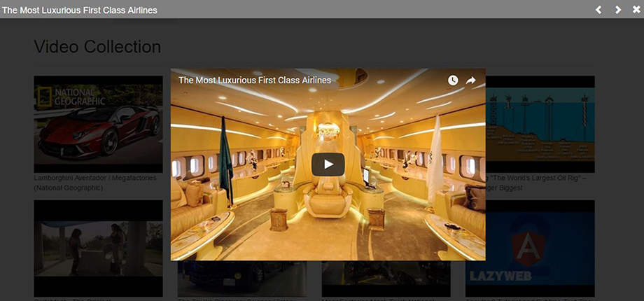

Simple Angular 2 application for palying embeded video from YouTube. 
<!--more-->

This is player I made for a real website.
There are few css and html works. Mostly I worked with Angular 2. In my real project I am going to add lots of css styles to make my player more attractive. 

## Samples  




## Installation


```bash
git clone  https://github.com/alexbra/ytplayer  my-proj
cd my-proj
npm i 
npm start
```


